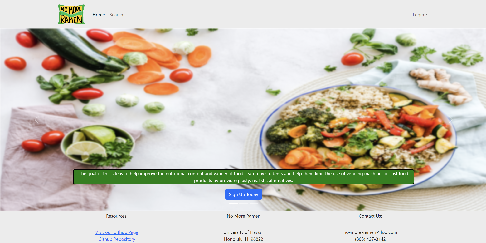
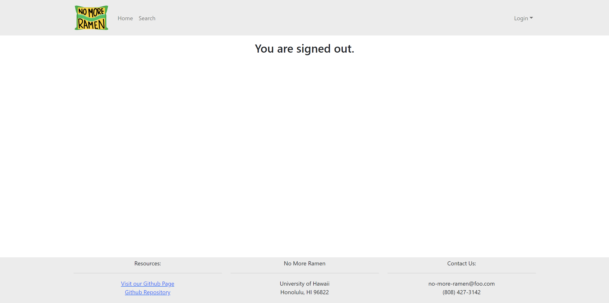
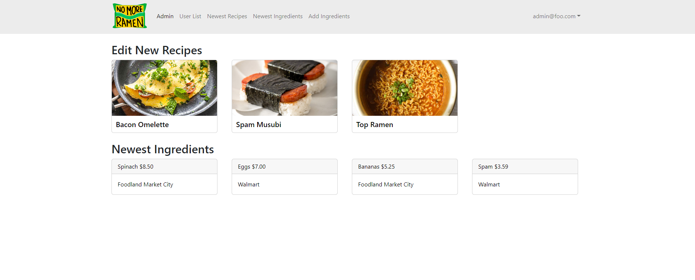
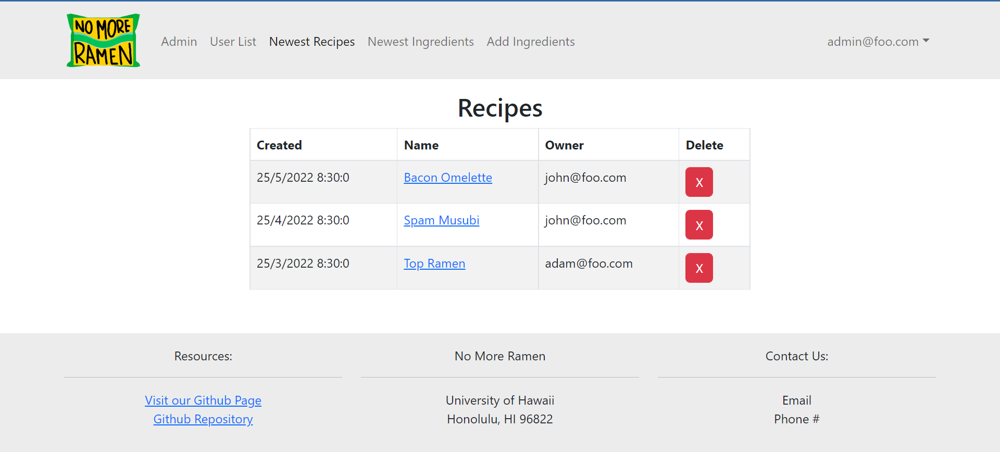
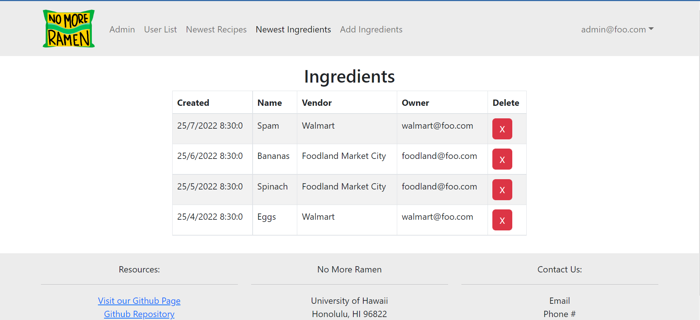
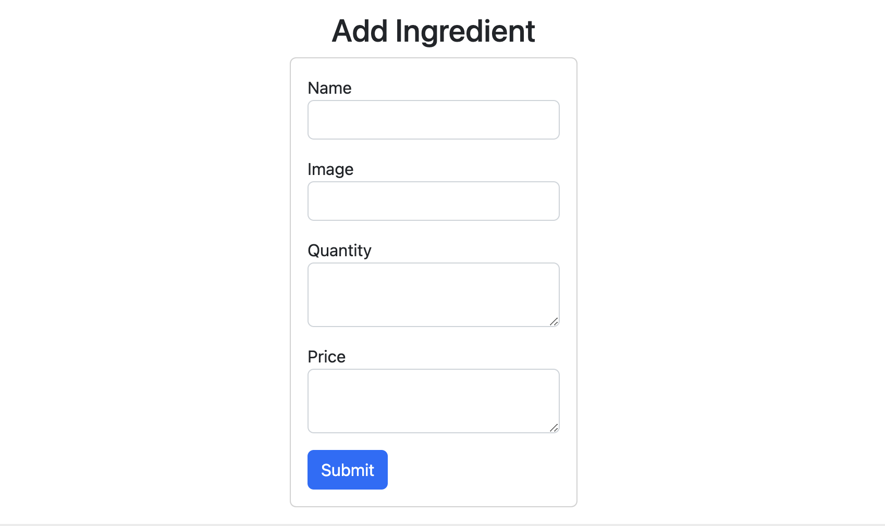
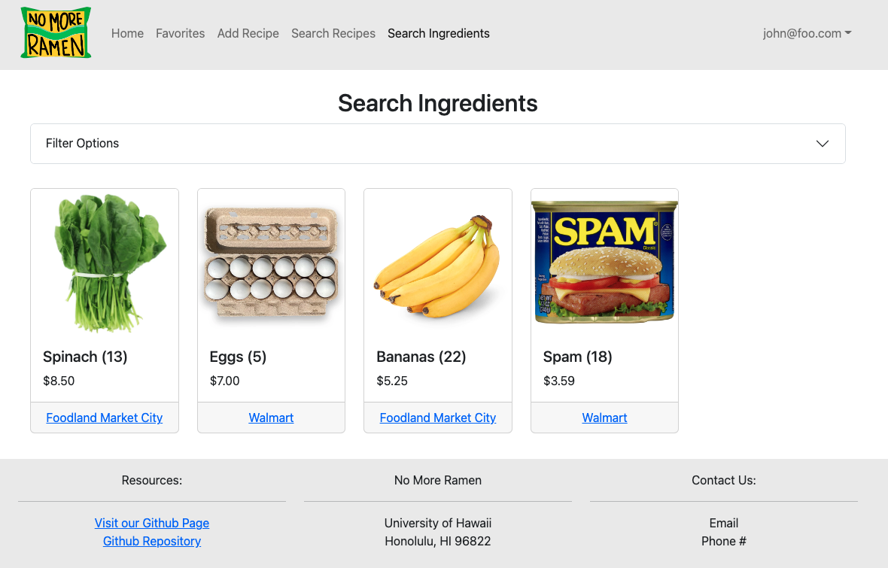

## Overview

### The Problem

Many college students have limited cooking skills, limited time, limited access to grocery stores, and no access to creative recipes that are within these contraints. As a result, students end up spending lots of money at fast food places or through vending machines.

### The Solution

No More Ramen is a web application that will allow students to learn and share recipes that:

  * Can be made using minimal kitchen facilities (at a minimum, a toaster oven).
  * Can be made out of ingredients that are available within walking distance of UH. 
  * Suit local taste sensibilities. 
  * Can be filtered via dietary restrictions (gluten-free, vegan, etc).
  * Have an estimated cost per serving. 
  * Has an estimated number of servings per recipe. 
  * Has an estimate of how long it takes to make.

The goal of this site is to help improve the nutritional content and variety of foods consumed by students.

## Developer Guide

### Installation

First, [install Meteor](https://www.meteor.com/developers/install)

Second, visit the [No More Ramen application github page](https://github.com/no-more-ramen/no-more-ramen), and click the "Use this template" button to create your own repository.

Third, go to your newly created repository and download your new GitHub repo to your local file system. [GitHub Desktop](https://desktop.github.com/) is a great choice if you use MacOS or Windows.

Fourth, cd into the app/ directory of your local copy of the repo, and install third party libraries with:
```
$ meteor npm install
```
Fifth, run the system with:
```
$ meteor npm run start
```
If all goes well it will appear at [http://localhost:3000/](http://localhost:3000/)

### ESLint
To verify that the code obeys coding standards, you can run ESLint over the code using:
```
meteor npm run lint
```

## Development History

| Milestones                                             | Description                                                                                                                                                                                                                                                        |
|--------------------------------------------------------|--------------------------------------------------------------------------------------------------------------------------------------------------------------------------------------------------------------------------------------------------------------------|
| [M1](https://github.com/orgs/no-more-ramen/projects/1) | Our main goal of Milestone 1 was to create Mockups of our pages so we had a general idea of how we wanted our site to look like. We also created a landing page. The landing page is meant to help users get a general understanding of what our website is about. |
| [M2](https://github.com/orgs/no-more-ramen/projects/2) | Our main goal of Milestone 2 was to improve the functionality and quality of our website beyond Milestone 1.                                                                                                                                                       |
| [M3](https://github.com/orgs/no-more-ramen/projects/3) | Our main goal of Milestone 3 was to implement a significant amount of real information. We will also be asking for user feedback.                                                                                                                                  |

## Deployment
Our project is deployed on [Digital Ocean](https://nomoreramen.xyz/) for everyone to see it.

## User Guide

The following sections describe the major features of this template.

### Directory structure

The top-level directory structure is:

```
.github     # holds the GitHub Continuous Integration action and Issue template.
app/        # holds the Meteor application sources
config/     # holds configuration files, such as settings.development.json
doc/        # holds developer documentation, user guides, etc.
.gitignore  # don't commit IntelliJ project files, node_modules, and settings.production.json
```

This structure separates documentation files (such as screenshots) and configuration files (such as the settings files) from the actual Meteor application.

The app/ directory has this structure:

```
.deploy/
  .gitignore     # don't commit mup.js or settings.json
  mup.sample.js  # sample mup.js file used for deploying the application
  settings.sample.json # sample settings file
  
client/
  main.html      # The boilerplate HTML with a "root" div to be manipulated by React.
  main.js        # import startup files.

imports/
  api/           # Define collections
    recipe/       # The Recipe collection definition
    ingredient/    # The Ingredient collection definition 
    student/    # The Student collection definition 
    vendor/    # The Vendor collection definition 
  startup/       # Define code to run when system starts up (client-only, server-only, both)
    client/
    server/
  ui/
    components/  # Contains page elements, some of which could appear on multiple pages.
    layouts/     # Contains top-level layout (<App> component).
    pages/       # Contains components for each page.

node_modules/    # managed by npm

public/          # static assets (like images) can go here.

server/
   main.js       # import the server-side js files.
   
tests/           # testcafe acceptance tests.
```

#### Landing page

When you first visit the site, this is what should be displayed:



The next step is to use the Login menu to either Login to an existing account or register a new account.

#### Login page

Clicking on the Login link, then on the Sign In menu item displays this page:


#### Register page

Alternatively, clicking on the Login link, then on the Sign Up menu item displays this page:


#### Sign Out page

After logging out, this page displays:



#### Student Home page

Once you log in (either to an existing account or by creating a new one), the navbar changes as follows:


You can now add new Recipe documents, and list the recipe you have created. Note you cannot see any Recipe created by other users.

#### Vendor Home page

This page lists all ingredients that a vendor has listed for sale with the option to edit an existing ingredient and add new ingredients.


#### Admin Home page

You can define an "admin" user in the settings.json file. This user, after logging in, gets a special entry in the navbar:



#### Newest Recipes and Newest Ingredients pages

Admins have the ability to view all of the added ingredients and recipes, sorted by the added date. They are also able to remove specific items here: 




#### Student Profile page

After you log in, you can click on a dropdown on the navbar to get to your profile:


#### Vendor Profile page

After you log in, you can click on a dropdown on the navbar to get to your profile:


#### Add Recipe page

After logging in, here is the page that allows you to add new Recipe:


#### Add Ingredients page

This page will allow vendors to add ingredients:



#### Individual Recipe page

This page contains the full details of each recipe including a photo, dietary restrictions, ingredients list, and instructions. Users can see which vendors are selling the ingredients by hovering over each ingredient in the list.


#### Search Recipe page

This page allows you to search for a recipe based on name, ingredients, size, etc.


#### Search Ingredients page

This page allows you to search for an ingredient based on name, quantity, price, and vendor.



## Team
No More Ramen is designed, implemented, and maintained by a team consisting of five members: [Bradley Valiente](https://b-valiente.github.io/), [Shannon Kam](https://shannonkam.github.io/), [Kayla Hirano](https://khirano7.github.io/), [Khanh Nguyen](https://1khanh.github.io/), and [Jun Kim](https://junkim1519.github.io/).

All members have signed a [team contract](https://docs.google.com/document/d/1hnYz5VQLM7qV9ZZo8wsZYuB6PCHSuUI5v0Pi1Q_j45Y/edit?usp=sharing).
