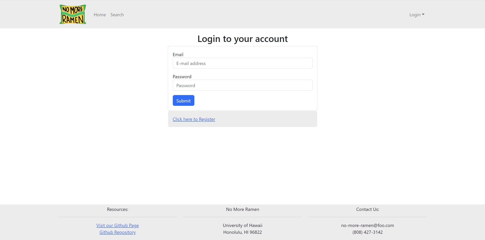
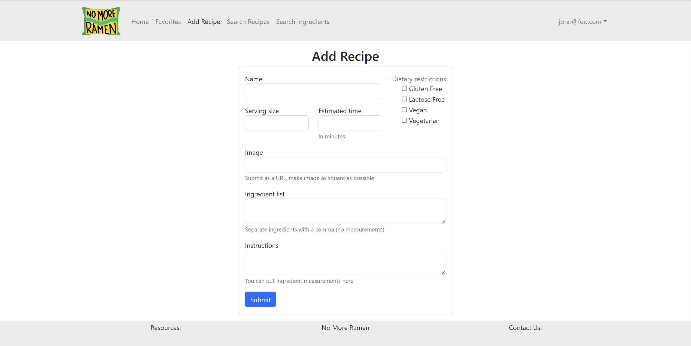
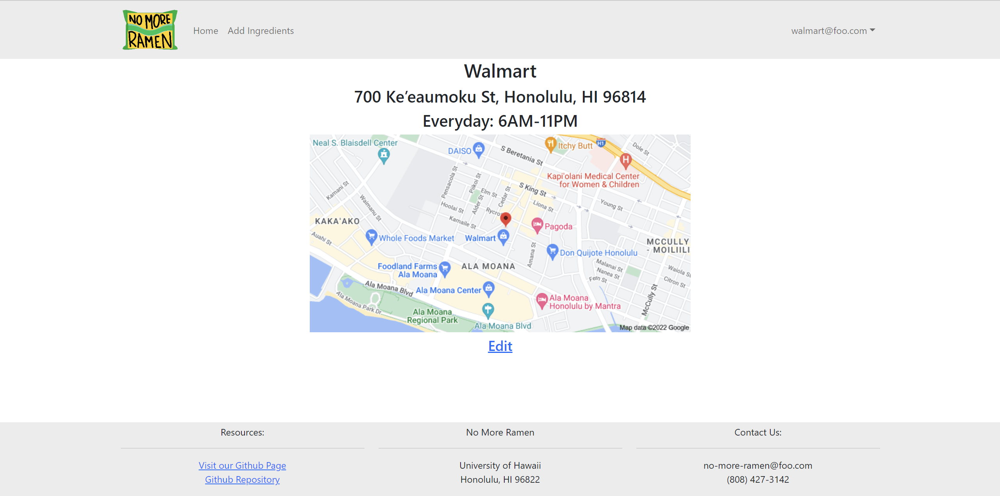

[Team Contract](https://docs.google.com/document/d/1hnYz5VQLM7qV9ZZo8wsZYuB6PCHSuUI5v0Pi1Q_j45Y/edit?usp=sharing)

## Overview

No More Ramen is a web application that will allow students to learn and share recipes that:

  * Can be made using minimal kitchen facilities (at a minimum, a toaster oven).
  * Can be made out of ingredients that are available within walking distance of UH. 
  * Suit local taste sensibilities. 
  * Can be filtered via dietary restrictions (gluten-free, vegan, etc).
  * Have an estimated cost per serving. 
  * Has an estimated number of servings per recipe. 
  * Has an estimate of how long it takes to make.

## Walkthrough

The following sections describe the major features of this template.

### Directory structure

The top-level directory structure is:

```
.github     # holds the GitHub Continuous Integration action and Issue template.
app/        # holds the Meteor application sources
config/     # holds configuration files, such as settings.development.json
doc/        # holds developer documentation, user guides, etc.
.gitignore  # don't commit IntelliJ project files, node_modules, and settings.production.json
```

This structure separates documentation files (such as screenshots) and configuration files (such as the settings files) from the actual Meteor application.

The app/ directory has this structure:

```
.deploy/
  .gitignore     # don't commit mup.js or settings.json
  mup.sample.js  # sample mup.js file used for deploying the application
  settings.sample.json # sample settings file
  
client/
  main.html      # The boilerplate HTML with a "root" div to be manipulated by React.
  main.js        # import startup files.

imports/
  api/           # Define collections
    Recipe/       # The Recipes collection definition
    Ingredients/    # The Ingredients collection definition 
  startup/       # Define code to run when system starts up (client-only, server-only, both)
    client/
    server/
  ui/
    components/  # Contains page elements, some of which could appear on multiple pages.
    layouts/     # Contains top-level layout (<App> component).
    pages/       # Contains components for each page.

node_modules/    # managed by npm

public/          # static assets (like images) can go here.

server/
   main.js       # import the server-side js files.
   
tests/           # testcafe acceptance tests.
```

#### Landing page

When you first visit the site, this is what should be displayed:


The next step is to use the Login menu to either Login to an existing account or register a new account.

#### Login page

Clicking on the Login link, then on the Sign In menu item displays this page:



#### Register page

Alternatively, clicking on the Login link, then on the Sign Up menu item displays this page:


#### Student Home page

Once you log in (either to an existing account or by creating a new one), the navbar changes as follows:


You can now add new Recipe documents, and list the recipe you have created. Note you cannot see any Recipe created by other users.

#### Student Profile Page

After you log in, you can click on a dropdown on the navbar to get to your profile:


#### Add Recipe page

After logging in, here is the page that allows you to add new Recipe:



#### Individual Recipe page

This page contains the full details of each recipe including a photo, ingredients list, and instructions


#### Search Recipe page

This page allows you to search for a recipe based on name, ingredients, size, etc.


#### Vendor Home page

This page will list all ingredients that a vendor has listed for sale with the option to edit and add ingredients


#### Vendor Profile Page

After you log in, you can click on a dropdown on the navbar to get to your profile:



#### Vendor Add Ingredients page

This page will allow vendors to add ingredients:


#### Admin Home page

You can define an "admin" user in the settings.json file. This user, after logging in, gets a special entry in the navbar:


#### Admin page (list all users Recipe)

To provide a simple example of a "super power" for Admin users, the Admin page lists all of the recipes by all of the users:


Note that non-admin users cannot get to this page, even if they type in the URL by hand.

### Collections

The application implements a single Collection called "Recipes". Each Recipes document has the following fields: name, quantity, condition, and username.

The Recipes collection is defined in [imports/api/Recipe/Recipe.js](https://github.com/ics-software-engineering/meteor-application-template-react/blob/main/app/imports/api/Recipe/Recipe.js).

The Recipes collection is initialized in [imports/startup/server/Mongo.js](https://github.com/ics-software-engineering/meteor-application-template-react/blob/main/app/imports/startup/server/Mongo.js).

### Routing

For display and navigation among its four pages, the application uses [React Router](https://reacttraining.com/react-router/).

Routing is defined in [imports/ui/layouts/App.jsx](https://github.com/ics-software-engineering/meteor-application-template-react/blob/main/app/imports/ui/layouts/App.jsx).


### Authentication

For authentication, the application uses the Meteor accounts package.

When the application is run for the first time, a settings file (such as [config/settings.development.json](https://github.com/ics-software-engineering/meteor-application-template-react/blob/main/config/settings.development.json)) should be passed to Meteor. That will lead to a default account being created through the code in [imports/startup/server/accounts.js](https://github.com/ics-software-engineering/meteor-application-template-react/blob/main/app/imports/startup/server/accounts.js).

The application allows users to register and create new accounts at any time.

### Authorization

Only logged in users can manipulate Recipe documents (but any registered user can manipulate any Recipe document, even if they weren't the user that created it.)

### Configuration

The [config](https://github.com/ics-software-engineering/meteor-application-template-react/blob/main/config) directory is intended to hold settings files.  The repository contains one file: [config/settings.development.json](https://github.com/ics-software-engineering/meteor-application-template-react/blob/main/config/settings.development.json).

The [.gitignore](https://github.com/ics-software-engineering/meteor-application-template-react/blob/main/.gitignore) file prevents a file named settings.production.json from being committed to the repository. So, if you are deploying the application, you can put settings in a file named settings.production.json and it will not be committed.
