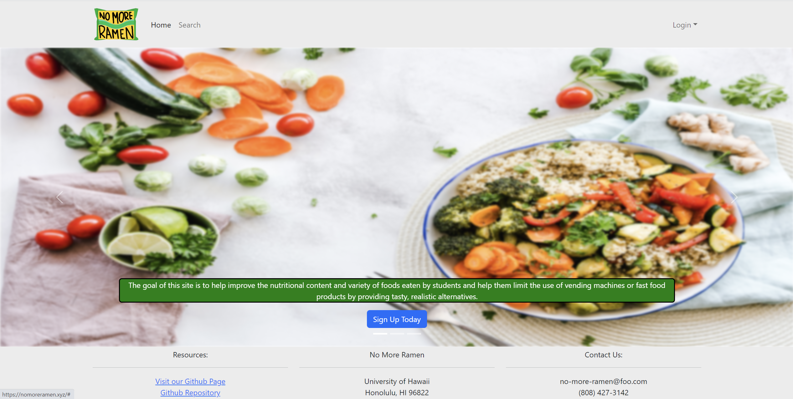
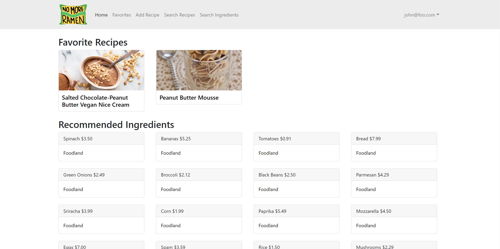
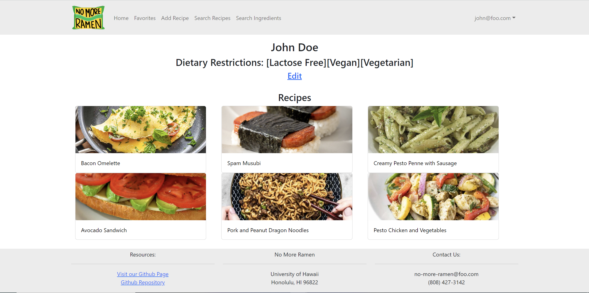
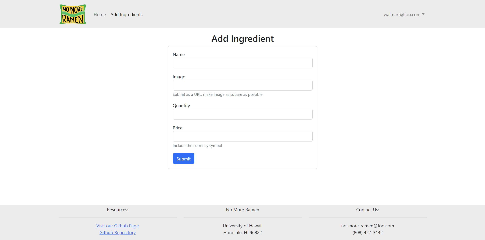
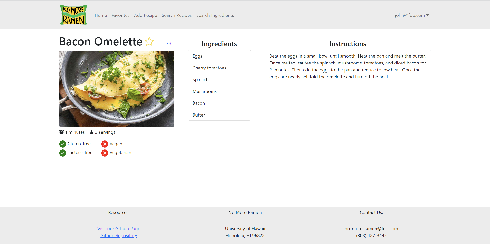
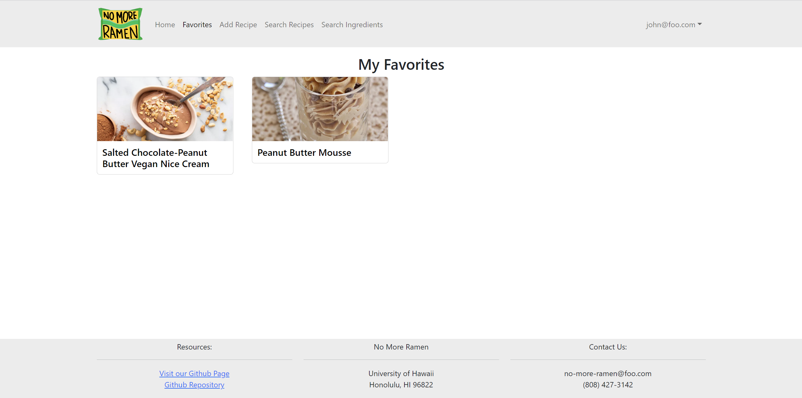
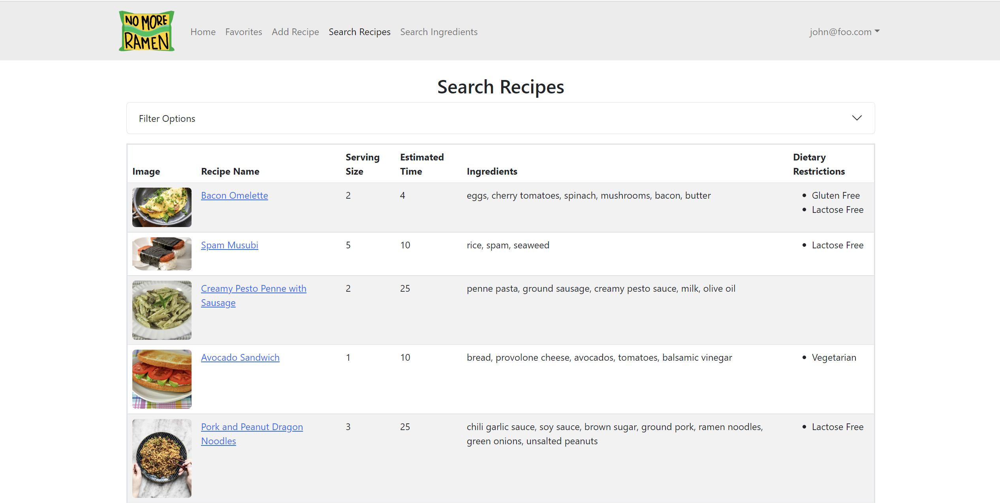
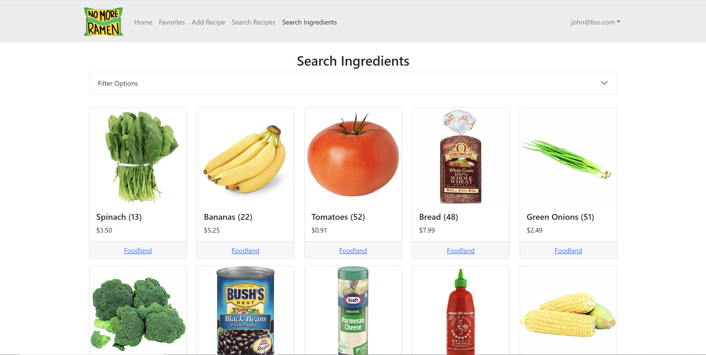

## Overview

### The Problem

Many college students have limited cooking skills, limited time, limited access to grocery stores, and no access to creative recipes that are within these contraints. As a result, students end up spending lots of money at fast food places or through vending machines.

### The Solution

No More Ramen is a web application that will allow students to learn and share recipes that:

  * Can be made using minimal kitchen facilities (at a minimum, a toaster oven).
  * Can be made out of ingredients that are available within walking distance of UH. 
  * Suit local taste sensibilities. 
  * Can be filtered via dietary restrictions (gluten-free, vegan, etc).
  * Have an estimated cost per serving. 
  * Has an estimated number of servings per recipe. 
  * Has an estimate of how long it takes to make.

The goal of this site is to help improve the nutritional content and variety of foods consumed by students.

## Developer Guide

### Installation

First, [install Meteor](https://www.meteor.com/developers/install)

Second, visit the [No More Ramen application github page](https://github.com/no-more-ramen/no-more-ramen), and click the "Use this template" button to create your own repository.

Third, go to your newly created repository and download your new GitHub repo to your local file system. [GitHub Desktop](https://desktop.github.com/) is a great choice if you use MacOS or Windows.

Fourth, cd into the app/ directory of your local copy of the repo, and install third party libraries with:
```
$ meteor npm install
```
Fifth, run the system with:
```
$ meteor npm run start
```
If all goes well it will appear at [http://localhost:3000/](http://localhost:3000/)

### ESLint
To verify that the code obeys coding standards, you can run ESLint over the code using:
```
meteor npm run lint
```

## Development History

| Milestones                                             | Description                                                                                                                                                                                                                                                        |
|--------------------------------------------------------|--------------------------------------------------------------------------------------------------------------------------------------------------------------------------------------------------------------------------------------------------------------------|
| [M1](https://github.com/orgs/no-more-ramen/projects/1) | Our main goal of Milestone 1 was to create Mockups of our pages so we had a general idea of how we wanted our site to look like. We also created a landing page. The landing page is meant to help users get a general understanding of what our website is about. |
| [M2](https://github.com/orgs/no-more-ramen/projects/2) | Our main goal of Milestone 2 was to improve the functionality and quality of our website beyond Milestone 1.                                                                                                                                                       |
| [M3](https://github.com/orgs/no-more-ramen/projects/3) | Our main goal of Milestone 3 was to implement a significant amount of real information. We also asked for user feedback.                                                                                                                                           |

## Deployment
Our project is deployed on [Digital Ocean](https://nomoreramen.xyz/) for everyone to see it.

## User Guide

The following sections describe the major features of this template.

#### Landing page

When you first visit the site, this is what should be displayed:



The next step is to use the Login menu to either Login to an existing account or register a new account.

#### Login page

Clicking on the Login link, then on the Sign In menu item displays this page:


#### Register page

Alternatively, clicking on the Login link, then on the Sign Up menu item displays this page:


#### Sign Out page

After logging out, this page displays:


#### Student Home page

Once you log in (either to an existing account or by creating a new one), the navbar changes as follows:



You can now add new Recipe documents, and list the recipe you have created. Note you cannot see any Recipe created by other users.

#### Vendor Home page

This page lists all ingredients that a vendor has listed for sale with the option to edit an existing ingredient and add new ingredients.


#### Admin Home page

You can define an "admin" user in the settings.json file. This user, after logging in, gets special entries in the navbar:


Admins are able to view and edit all existing users. Admins also have the ability to view all of the added ingredients and recipes, sorted by the added date. They are able to remove or edit specific items.

#### Student Profile page

After you log in, you can click on a dropdown on the navbar to get to your profile:



#### Vendor Profile page

After you log in, you can click on a dropdown on the navbar to get to your profile:


#### Add Recipe page

After logging in, here is the page that allows you to add new Recipe:


#### Add Ingredients page

This page will allow vendors to add ingredients:



#### Individual Recipe page

This page contains the full details of each recipe including a photo, dietary restrictions, ingredients list, and instructions. Users can see which vendors are selling the ingredients by hovering over each ingredient in the list. Users can favorite a recipe by clicking on the star icon.



#### Favorites page

This page shows all the recipes that a user favorites.



#### Search Recipe page

This page allows you to search for a recipe based on name, ingredients, size, etc.



#### Search Ingredients page

This page allows you to search for an ingredient based on name, quantity, price, and vendor.



## Community Feedback

### David L.

* UI is easy to use. Easy navigation through links.
* No bugs were encountered.
* As a vendor, I would have liked the option to search through recipes and ingredients to see what was trending.
* Overall design was professional and easy to use.

### Simplicio J.

* Very simplistic, almost everything was easy to read. Intuitive and easy-to-learn interface.
* No bugs!
* The space above the sign up button and text could be condensed a little bit, but for the most part everything was great.
* Love this website, honestly this would be something that I wouldn't mind using on a day-to-day basis when organizing my recipes. Excellent job!

### Jeraldine M.

* I like the search recipes tab, and that we can see which vendors sells items.
* No bugs.
* Would love to see how you will implement the google maps API next time and have clearer pictures used.
* It's a nice simple app.

### Branden T.

* Layout is quite clean, compared to other websites I have seen. The search filters are a great feature and seem to work well. The "Add Recipe" is definitely a great idea which actual users would find convenient.
* The text on the home page may be too small for some users to read. The images themselves are not of the highest quality, but they get the point across.
* Being able to order the recipes by alphabetical order, serving size, and estimated time may be a good feature to implement in the future (e.g. if someone wanted to see the recipes in order from most servings to least). Additionally, perhaps a "Cancel" button for vendors when adding/editing ingredients.
* Overall, great functionality and practicality. Navigation is pretty straightforward and the page layouts are nice and simple. I could see this website being of great use if it were to be implemented for real students to use, and it could even be expanded for use across the country, and users could include their institution's location in order to account for only nearby vendors.

## Team
No More Ramen is designed, implemented, and maintained by a team consisting of five members: [Bradley Valiente](https://b-valiente.github.io/), [Shannon Kam](https://shannonkam.github.io/), [Kayla Hirano](https://khirano7.github.io/), [Khanh Nguyen](https://1khanh.github.io/), and [Jun Kim](https://junkim1519.github.io/).

All members have signed a [team contract](https://docs.google.com/document/d/1hnYz5VQLM7qV9ZZo8wsZYuB6PCHSuUI5v0Pi1Q_j45Y/edit?usp=sharing).
